== Работа в IAR Embedded Workbench
== Задание

Целью данной практической работы было создание кода программы,
который бы по нажатию кнопки менял состояние четырёх светодиодов на противополжные.
Также нужно тактироваться от частоты _10 МГц_ (или около _10 МГц_).

== Настройка частоты
Первым делом нужно было поработать с частотой. Включаем источник частоты *HSE*, ждём
пока он будет готов,
далее выбираем *HSE* как как источник тактирования, выключаем *HSI*, в конфигурации *PLL*
ставим *HSE* как источник и производим
вычисления.

Так как на *HSE* у нас _8 МГц_, то для того, чтобы получить на выходе
значение близкое к _10 МГц_, нам нужно
произвести следующие действия:

 8 МГц / 4 МГц = 2 МГц
 2 МГц * 50 МГц = 100 МГц
 100 МГц / 6 МГц = 16 МГц

.Полученный код
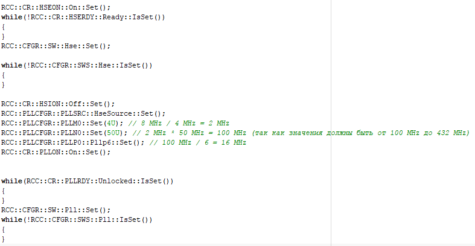

В ходе работы столкнулись с проблемой: Мы не смогли тактироваться от частоты, которая была бы
меньше _15 МГц_. Вручную, с помощью делителей были произведены многочисленные опыты по подбору
нижнего значения частоты. Самым минимальным из этих значений оказалось значение _16 МГц_.

== Работа с шаблонами

_**Шаблоны** (англ. *template*) — средство языка *C++*, предназначенное для кодирования
обобщённых алгоритмов, без привязки к некоторым параметрам
(например, типам данных, размерам буферов, значениям по умолчанию)._

В **C++ ** возможно создание шаблонов функций и классов.

_Шаблоны позволяют создавать параметризованные классы и функции.
Параметром может быть любой тип или значение одного из допустимых
типов (целое число, enum, указатель на любой объект с глобально доступным именем, ссылка)._

Чтобы получить структуру следующего вида нам нужно поработать с классами.

.Желаемый код
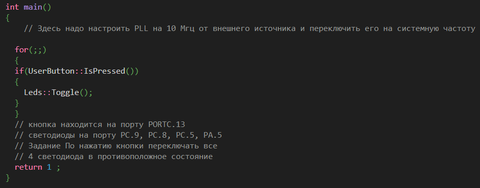

Создадим 4 класса:

- *Port* - отвечает за работу с портом ( вместо *T* будем передавать значения портов: *GPIOA*, *GPOIC* и т.д.);
- *Pin* - отвечает за переключение одной ножки;
- *Button* - отвечает за переключение кнопки;
- *Leds* - за работу со светодиодами.

.Созданные классы
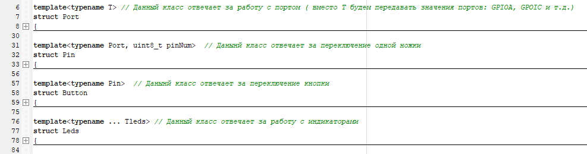

В каждом классе описаны определенные функции, которые приведены на рисунках ниже:

.Port
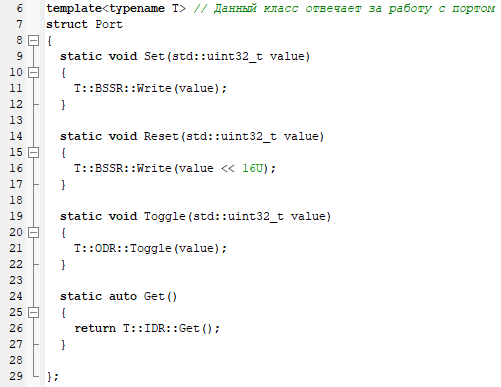

.Pin
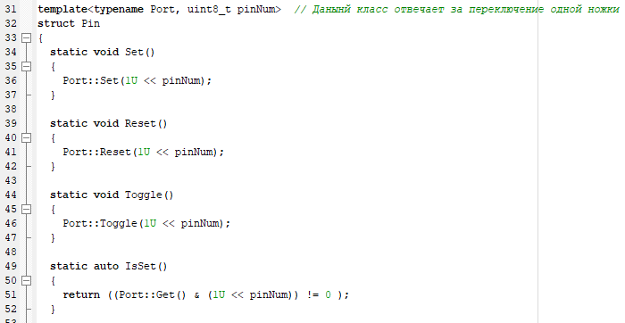

.Button
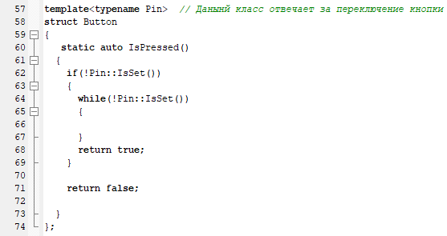

.Leds
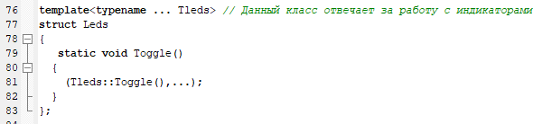

Также дополнительно была создана функция *Delay*:

.Функция задержки
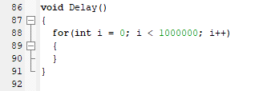

Затем, с помощью *using*, введём пользовательские типы:

.Использование *using*
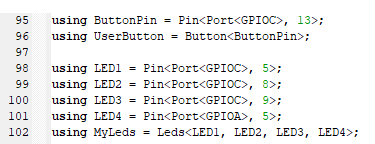

Полученный код имеет следующий вид:

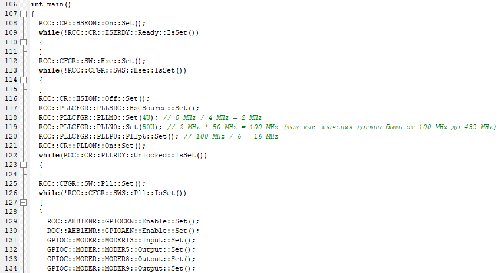
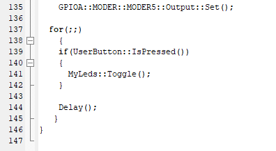

Запустим программу и посмотрим на результат. Мы получили, что при нажатии кнопки,
у нас включаются все четыре светодиода. Результат в формате *gif* лежит в папке *Photo*.

